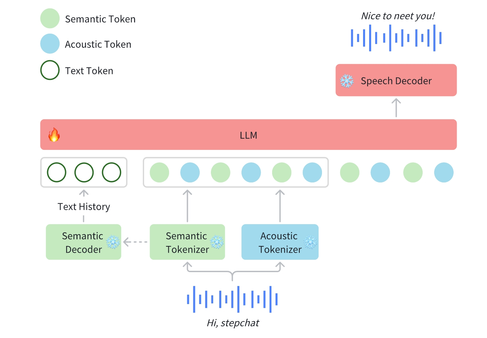

# Step-Audio

## Table of Contents

1. [Introduction](#1-introduction)
2. [Model Summary](#2-model-summary)
3. [Model Download](#3-model-download)
4. [Model Usage](#4-model-usage)
5. [Benchmark](#5-benchmark)
6. [Online Engine](#6-online-engine)
7. [Citation](#7-citation)

## 1. Introduction

Step-Audio is a state-of-the-art end-to-end voice model, proposed by StepFun. Step-Audio processes and generates both text and speech inputs/outputs in a unified framework, supporting multilingual conversations (e.g., Chinese, English, Japanese), emotional tones (e.g., joy/sadness), regional dialects (e.g., Cantonese/Sichuanese), adjustable speech rates, and prosodic styles (e.g., rap). Step-Audio demonstrates three key technical innovations:

- Dual-codebook speech tokenizer: Decouples content and paralinguis-
tic feature encoding for efficient compatibility with complex dialects and prosodic patterns.

- Speech RLHF optimization: Integrates human feedback reinforcement
learning to enhance speech naturalness and instruction alignment.

- Full-stack acceleration: Implements slice delay compensation and specu-lative decoding, improving inference efficiency by 40% (vs. LLaMA-Omni). 

## 2. Model Summary
In Step-Audio, audio streams are tokenized via a dual-codebook framework, combining parallel semantic (16.7Hz, 1024-entry codebook) and acoustic (25Hz, 4096-entry codebook) tokenizers with 2:3 temporal interleaving. A 130B-parameter LLM foundation (Step-1) is further enhanced via audio-contextualized continual pretraining and task-specific post-training, enabling robust cross-modal speech understanding. A hybrid speech decoder combining flow matching with neural vocoding, optimized for real-time waveform generation. A streaming-aware architecture featuring speculative response generation (40\% commit rate) and text-based context management (14:1 compression ratio) for efficient cross-modal alignment.


### 2.1 Tokenizer

We implement a token-level interleaving approach to effectively integrate semantic tokenization and acoustic tokenization. The semantic tokenizer employs a codebook size of 1024, while the acoustic tokenizer utilizes a larger codebook size of 4096 to capture finer acoustic details. Given the differing token rates, we establish a temporal alignment ratio of 2:3, where every two semantic tokens are paired with three acoustic tokens.

### 2.2 Language Model

To enhance Step-Audio’s ability to effectively process speech information and
achieve accurate speech-text alignment, we conducted audio continual pretrain-ing based on Step-1, a 130-billion parameter pretrained text-based large language model (LLM). 

### 2.3 Speech Decoder
The speech decoder in Step-Audio serves a critical function in converting discrete speech tokens, which contain both semantic and acoustic information, into continuous time-domain waveforms that represent natural speech. The decoder architecture incorporates a flow matching model and a mel-to-wave vocoder. To optimize the intelligibility and naturalness of the synthesized speech, the speech decoder is trained using a dual-code interleaving approach, ensuring seamless integration of semantic and acoustic features throughout the generation process.

### 2.4 Real-time Inference Pipeline
To enable real-time interactions, we have designed an optimized inference pipeline. At its core, the Controller module manages state transitions, orchestrates speculative response generation, and ensures seamless coordination between critical subsystems. These subsystems include Voice Activity Detection (VAD) for detecting user speech, the Streaming Audio Tokenizer for processing audio in real-time, the Step-Audio language model and Speech Decoder for processing and generating responses, and the Context Manager for preserving conversational continuity.


### 2.5 Post training details
The Step-Audio-Chat training pipeline employs a two-stage alignment strategy: Supervised Fine-Tuning (SFT) for initial instruction grounding, followed by Reinforcement Learning from Human Feedback (RLHF) to enhance instruction following while maintaining safety protocols and mitigating model hallucinations.


## 3. Model Download
| Models   | Links   |
|-------|-------|
| Step-Audio | [🤗huggingface](https://huggingface.co/stepfun-ai/) |
| Step-Audio-Chat | [🤗huggingface](https://huggingface.co/stepfun-ai/) |

## 4. Model Usage
### 📜 4.1  Requirements
The following table shows the requirements for running Step-Audio model (batch size = 1):

|     Model    |  Setting<br/>(sample frequency) | GPU Peak Memory  |  Wall Clock Time |
|------------|--------------------------------|----------------|----------------|
| Step-Audio-Chat   |        16.7Hz          |               |
| Step-Audio-TTS   |        25Hz          |               |

* An NVIDIA GPU with CUDA support is required. 
  * The model is tested on a four H800 80G GPU.
  * **Minimum**: The minimum GPU memory required is xGB.
  * **Recommended**: We recommend using a GPU with 80GB of memory for better generation quality.
* Tested operating system: Linux

### 🔧 4.2 Dependencies and Installation
- Python >= 3.10.0 (Recommend to use [Anaconda](https://www.anaconda.com/download/#linux) or [Miniconda](https://docs.conda.io/en/latest/miniconda.html))
- [PyTorch >= 2.3-cu121](https://pytorch.org/)
- [CUDA Toolkit](https://developer.nvidia.com/cuda-downloads)

```bash
git clone https://github.com/stepfun-ai/Step-Audio.git
conda create -n stepaudio python=3.10
conda activate stepaudio

cd Step-Audio
pip install -e .
```

###  🚀 4.3 Inference Scripts
```bash
python api/call_remote_server.py --model_dir where_you_download_dir &  ## We assume you have more than 4 GPUs available. This command will return the URL for both the caption API and the VAE API. Please use the returned URL in the following command.

parallel=4  # or parallel=8
url='127.0.0.1'
model_dir=where_you_download_dir

torchrun --nproc_per_node $parallel run_step_audio.py --args xxx
```

## 5. Benchmark

### 5.1 ASR
### 5.2 TTS
| Model          | test-zh CER (%) ↓ | test-en WER (%) ↓ |
|----------------|-------------------|-------------------|
| GLM-4-Voice    | 2.19              | 2.91              |
| MinMo          | 2.48              | 2.90              |
| **Step-Audio**  | **1.72**          | **2.71**          |

### 5.3 AQTA Chat
We release StepEval Audio 360 as a new benchmark, which consists of 100 multi-turn Chinese prompts sourced from real users and is designed to evaluate the quality of generated response across the following dimensions: linguistic competence, emotional intelligence, logical reasoning, creative generation, commonsense knowledge, complex instruction adherence, role-playing capabilities, gaming interactions, real-world task handling, memory retention, safety compliance, educational tutoring, and comprehensive understanding.

#### StepEval Audio 360
| Model          | factuality (%) ↑ | relevance ↑ | chat score ↑ |
|----------------|------------------|-------------|--------------|
| GLM4-Voice     | 59.0             | 67.0        | 3.75         |
| Qwen2-Audio    | 24.0             | 31.0        | 2.60         |
| Moshi*         | 1.0              | 0           | 1.49         |
| **Step-Audio**  | **65.0**         | **80.0**    | **4.22**     |

#### Public Test Set
| Model          | Llama Question    | Web Questions | TriviaQA* |
|----------------|-------------------|---------------|-----------|
| GLM4-Voice     | 64.7              | 32.2          | 39.1      |
| Moshi          | 62.3              | 26.6          | 22.8      |
| Freeze-Omni    | 72.0              | 44.7          | 53.9      |
| LUCY           | 59.7              | 29.3          | 27.0      |
| minmo          | 78.9              | **55.0**      | 48.3      |
| Qwen2-Audio    | 52.0              | 27.0          | 45.2      |
| **Step-Audio**  | **80.0(83.0)**    | 51.5          | **61.9**  |

*TriviaQA dataset marked with "*" indicates results are for reference only.*

## 6. Online Engine
The online version of Step-Audio can be accessed from app version of [跃问](https://yuewen.cn), where some impressive examples can be found as well.

## 7. Citation
```
@misc{stepaudiotechnicalreport,
      title={Step-Audio Technical Report: Harmonized Understanding
and Generation for Controllable, Tool-Augmented Speech Interaction}, 
      author={Step-Audio Team},
      year={2025},
}
```