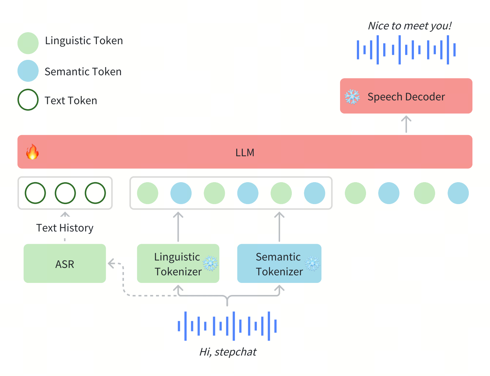
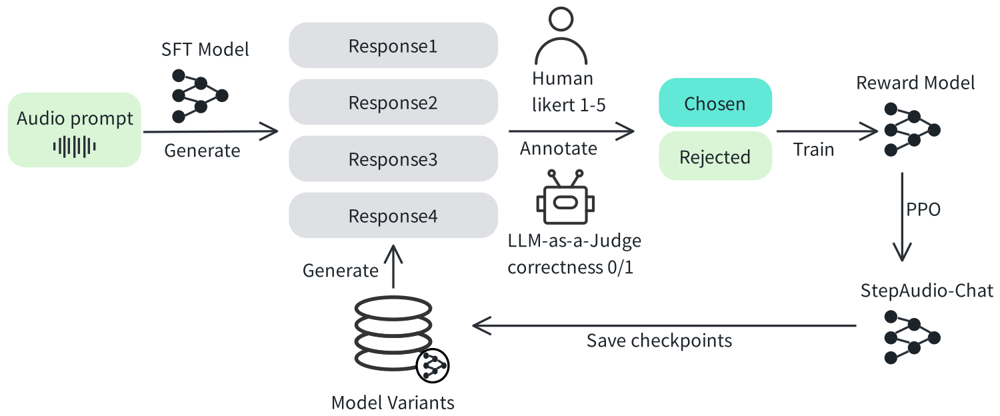
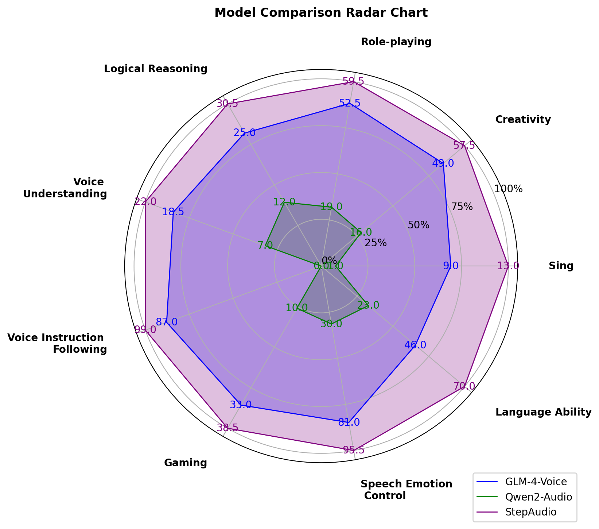

<p align="left">
        中文</a>&nbsp ｜ &nbsp<a href="README.md">English</a>
</p>
<br><br>

# Step-Audio
<p align="center">
  
</p>
<div align="center">
  <a href="https://github.com/stepfun-ai/Step-Audio/blob/cn-readme/assets/Step-Audio.pdf"></a> &ensp;
  <a href="https://x.com/StepFun_ai"></a> &ensp;
</div>

<div align="center">
  <a href="https://huggingface.co/stepfun-ai/Step-Audio-Chat"></a> &ensp;
  <a href="https://huggingface.co/stepfun-ai/Step-Audio-TTS-3B"></a> &ensp;
</div>
<div align="center">
  <a href="https://huggingface.co/stepfun-ai/Step-Audio-Tokenizer"></a> &ensp;
  <a href="https://huggingface.co/datasets/stepfun-ai/StepEval-Audio-360"></a> &ensp;
</div>

## 🔥🔥🔥 News!!
* 2025年2月17日: 👋 发布推理代码和模型权重，其中包含[Step-Audio-Chat](https://huggingface.co/stepfun-ai/Step-Audio-Chat), [Step-Audio-TTS-3B](https://huggingface.co/stepfun-ai/Step-Audio-TTS-3B) 和 [Step-Audio-Tokenizer](https://huggingface.co/stepfun-ai/Step-Audio-Tokenizer)。
* 2025年2月17日: 👋 发布多轮音频交互基准测试[StepEval-Audio-360](https://huggingface.co/datasets/stepfun-ai/StepEval-Audio-360)。
* 2025年2月17日: 👋 发布了技术报告[Step-Audio-Report](./assets/Step-Audio.pdf)。

## Table of Contents

1. [介绍](#1-介绍)
2. [模型组成](#2-模型组成)
3. [模型下载](#3-模型下载)
4. [模型使用](#4-模型使用)
5. [基准](#5-基准)
6. [在线引擎](#6-在线引擎)
7. [样例](#7-样例)
8. [引文](#8-引文)

## 1. 介绍

Step-Audio 是业界首个集语音理解与生成控制一体化的产品级开源实时语音对话系统，支持多语言对话（如 中文，英文，日语），语音情感（如 开心，悲伤），方言（如 粤语，四川话），可控制语速及韵律风格，支持RAP和哼唱等。其核心技术突破体现在以下四大技术亮点：

- **1300亿多模态模型**: 单模型能实现理解生成一体化完成语音识别、语义理解、对话、语音克隆、语音生成等功能，开源千亿参数多模态模型 Step-Audio-Chat。

- **高效数据生成链路**: 基于130B 突破传统 TTS 对人工采集数据的依赖，生成高质量的合成音频数据，并同步开源首个基于大规模合成数据训练，支持 RAP 和哼唱的指令加强版语音合成模型 Step-Audio-TTS-3B 。

- **精细语音控制**: 支持多种情绪（如生气，高兴，悲伤）、方言（包括粤语、四川话等）和唱歌（包括 RAP、干声哼唱）的精准调控，满足用户对多样化语音生成的需求。

- **扩展工具调用**: 通过 ToolCall 机制和角色扮演增强，进一步提升其在 Agents 和复杂任务中的表现。

## 2. 模型组成

在Step-Audio系统中，音频流采用Linguistic tokenizer（码率16.7Hz，码本大小1024）与Semantice tokenizer（码率25Hz，码本大小4096）并行的双码本编码器方案，双码本在排列上使用了2:3时序交错策略。通过音频语境化持续预训练和任务定向微调强化了130B参数量的基础模型（Step-1），最终构建了强大的跨模态语音理解能力。为了实现实时音频生成，系统采用了混合语音解码器，结合流匹配（flow matching）与神经声码技术。


### 2.1 Tokenizer

我们通过token级交错方法实现Linguistic token与Semantic token的有效整合。Linguistic tokenizer的码本大小是1024，码率16.7Hz；而Semantic tokenizer则使用4096的大容量码本来捕捉更精细的声学细节，码率25Hz。鉴于两者的码率差异，我们建立了2:3的时间对齐比例——每两个Linguistic token对应三个Linguistic token形成时序配对。

### 2.2 语言模型

为了提升Step-Audio有效处理语音信息的能力，并实现精准的语音-文本对齐，我们在Step-1（一个拥有1300亿参数的基于文本的大型语言模型LLM）的基础上进行了音频持续预训练。

### 2.3 语音解码器

Step-Audio语音解码器主要是将包含语义和声学信息的离散标记信息转换成连续的语音信号。该解码器架构结合了一个30亿参数的语言模型、流匹配模型（flow matching model）和梅尔频谱到波形的声码器（mel-to-wave vocoder）。为优化合成语音的清晰度（intelligibility）和自然度（naturalness），语音解码器采用双码交错训练方法（dual-code interleaving），确保生成过程中语义与声学特征的无缝融合。

### 2.4 实时推理管线
为了实现实时的语音交互，我们对推理管线进行了一系列优化。其中最核心的是控制模块（Controller），该模块负责管理状态转换、协调响应生成，并确保关键子系统间的无缝协同。这些子系统包括：

- **语音活动检测（VAD）**：实时检测用户语音起止

- **流式音频分词器（Streaming Audio Tokenizer）**：实时音频流处理

- **Step-Audio语言模型与语音解码器**：多模态回复生成

- **上下文管理器（Context Manager）**：动态维护对话历史与状态


### 2.5 后训练细节
在后训练阶段，我们针对自动语音识别（ASR）与文本转语音（TTS）任务进行了专项监督微调（Supervised Fine-Tuning, SFT）。对于音频输入-文本输出（Audio Question Text Answer, AQTA）任务，我们采用多样化高质量数据集进行SFT，并采用了基于人类反馈的强化学习（RLHF）以提升响应质量，从而实现对情感表达、语速、方言及韵律的细粒度控制。



## 3. 模型下载
### 3.1 Huggingface
| 模型   | 链接   |
|-------|-------|
| Step-Audio-Tokenizer | [🤗huggingface](https://huggingface.co/stepfun-ai/Step-Audio-Tokenizer) |
| Step-Audio-Chat | [🤗huggingface](https://huggingface.co/stepfun-ai/Step-Audio-Chat) |
| Step-Audio-TTS-3B | [🤗huggingface](https://huggingface.co/stepfun-ai/Step-Audio-TTS-3B) |

### 3.2 Modelscope
| 模型   | 链接   |
|-------|-------|
| Step-Audio-Tokenizer | [modelscope](https://modelscope.cn/models/stepfun-ai/Step-Audio-Tokenizer) |
| Step-Audio-Chat | [modelscope](https://modelscope.cn/models/stepfun-ai/Step-Audio-Chat) |
| Step-Audio-TTS-3B | [modelscope](https://modelscope.cn/models/stepfun-ai/Step-Audio-TTS-3B) |

## 4. 模型使用
### 📜 4.1  要求
下表列出了运行Step-Audio模型（batch size=1）所需的配置要求:

|     模型    |  Setting<br/>(采样率) | GPU最低显存  |
|------------|--------------------------------|----------------|
| Step-Audio-Tokenizer   |        41.6Hz          |       1.5GB        |
| Step-Audio-Chat   |        41.6Hz          |       265GB        |
| Step-Audio-TTS-3B   |        41.6Hz          |       8GB        |

* 需要支持CUDA的NVIDIA显卡.
  * 模型在4块显存为80GB的A800系列NVIDIA显卡上进行测试.
  * **推荐**: 为确保最佳生成质量，建议使用4块显存为80GB的A800/H800系列NVIDIA显卡.
* 测试采用的操作系统: Linux

### 🔧 4.2 依赖项与安装
- Python >= 3.10.0 (推荐使用 [Anaconda](https://www.anaconda.com/download/#linux) or [Miniconda](https://docs.conda.io/en/latest/miniconda.html))
- [PyTorch >= 2.3-cu121](https://pytorch.org/)
- [CUDA Toolkit](https://developer.nvidia.com/cuda-downloads)

```bash
git clone https://github.com/stepfun-ai/Step-Audio.git
conda create -n stepaudio python=3.10
conda activate stepaudio

cd Step-Audio
pip install -r requirements.txt

git lfs install
git clone https://huggingface.co/stepfun-ai/Step-Audio-Tokenizer
git clone https://huggingface.co/stepfun-ai/Step-Audio-Chat
git clone https://huggingface.co/stepfun-ai/Step-Audio-TTS-3B

```

下载模型后，where_you_download_dir应包含以下结构：
```
where_you_download_dir
├── Step-Audio-Tokenizer
├── Step-Audio-Chat
├── Step-Audio-TTS-3B
```

###  🚀 4.3 推理脚本
#### 离线推理
支持端到端音频/文本输入与音频/文本输出的推理流程。
```bash
python offline_inference.py --model-path where_you_download_dir
```

#### 语音合成推理
使用默认音色进行语音合成推理或使用新音色进行克隆
```bash
python tts_inference.py --model-path where_you_download_dir --output-path where_you_save_audio_dir --synthesis-type use_tts_or_clone
```
克隆模式需要音色信息字典，格式如下：
```bash
{
    "speaker": "speaker id",
    "prompt_text": "content of prompt wav",
    "wav_path": "prompt wav path"
}
```

#### 启动网页演示
启动本地服务器以进行在线推理。
假设您已配备4块GPU且已完成所有模型的下载。

```bash
python app.py --model-path where_you_download_dir
```

## 5. 基准

### 5.1 语音识别

<table>
    <thead>
        <tr>
            <th style="text-align:center"></th>
            <th colspan="4" style="text-align:center">隐层特征建模</th>
            <th colspan="5" style="text-align:center">离散标记建模</th>
        </tr>
        <tr>
            <th style="text-align:center"></th>
            <th style="text-align:center">Whisper Large-v3</th>
            <th style="text-align:center">Qwen2-Audio</th>
            <th style="text-align:center">MinMo</th>
            <th style="text-align:center">LUCY</th>
            <th style="text-align:center">Moshi</th>
            <th style="text-align:center">GLM-4-voice Base</th>
            <th style="text-align:center">GLM-4-voice Chat</th>
            <th style="text-align:center">Step-Audio Pretrain</th>
            <th style="text-align:center">Step-Audio-Chat</th>
        </tr>
    </thead>
    <tbody>
        <tr>
            <td>Aishell-1</td>
            <td style="text-align:center">5.14</td>
            <td style="text-align:center">1.53</td>
            <td style="text-align:center">-</td>
            <td style="text-align:center">2.4</td>
            <td style="text-align:center">-</td>
            <td style="text-align:center">2.46</td>
            <td style="text-align:center">226.47</td>
            <td style="text-align:center"><strong>0.87</strong></td>
            <td style="text-align:center">1.95</td>
        </tr>
        <tr>
            <td>Aishell-2 ios</td>
            <td style="text-align:center">4.76</td>
            <td style="text-align:center">3.06</td>
            <td style="text-align:center"><strong>2.69</strong></td>
            <td style="text-align:center">-</td>
            <td style="text-align:center">-</td>
            <td style="text-align:center">-</td>
            <td style="text-align:center">211.3</td>
            <td style="text-align:center">2.91</td>
            <td style="text-align:center">3.57</td>
        </tr>
        <tr>
            <td>Wenetspeech test-net</td>
            <td style="text-align:center">9.68</td>
            <td style="text-align:center">7.72</td>
            <td style="text-align:center"><strong>6.64</strong></td>
            <td style="text-align:center">8.78</td>
            <td style="text-align:center">-</td>
            <td style="text-align:center">-</td>
            <td style="text-align:center">146.05</td>
            <td style="text-align:center">7.62</td>
            <td style="text-align:center">8.75</td>
        </tr>
        <tr>
            <td>Wenet test-meeting</td>
            <td style="text-align:center">18.54</td>
            <td style="text-align:center">8.4</td>
            <td style="text-align:center"><strong>7.6</strong></td>
            <td style="text-align:center">10.42</td>
            <td style="text-align:center">-</td>
            <td style="text-align:center">-</td>
            <td style="text-align:center">140.82</td>
            <td style="text-align:center">7.78</td>
            <td style="text-align:center">9.52</td>
        </tr>
        <tr>
            <td>Librispeech test-clean</td>
            <td style="text-align:center">1.9</td>
            <td style="text-align:center"><strong>1.6</strong></td>
            <td style="text-align:center"><strong>1.6</strong></td>
            <td style="text-align:center">3.36</td>
            <td style="text-align:center">5.7</td>
            <td style="text-align:center">2.82</td>
            <td style="text-align:center">75.39</td>
            <td style="text-align:center">2.36</td>
            <td style="text-align:center">3.11</td>
        </tr>
        <tr>
            <td>Librispeech test-other</td>
            <td style="text-align:center">3.65</td>
            <td style="text-align:center"><strong>3.6</strong></td>
            <td style="text-align:center">3.82</td>
            <td style="text-align:center">8.05</td>
            <td style="text-align:center">-</td>
            <td style="text-align:center">7.66</td>
            <td style="text-align:center">80.3</td>
            <td style="text-align:center">6.32</td>
            <td style="text-align:center">8.44</td>
        </tr>
        <tr>
            <td>AVG</td>
            <td style="text-align:center">7.28</td>
            <td style="text-align:center"><strong>4.32</strong></td>
            <td style="text-align:center">-</td>
            <td style="text-align:center">-</td>
            <td style="text-align:center">-</td>
            <td style="text-align:center">-</td>
            <td style="text-align:center">146.74</td>
            <td style="text-align:center">4.64</td>
            <td style="text-align:center">5.89</td>
        </tr>
    </tbody>
</table>

### 5.2 语音合成
#### 5.2.1 与GLM-4-Voice与MinMo在内容一致性（CER/WER）上的性能对比。

<table>
    <thead>
        <tr>
            <th rowspan="2">Model</th>
            <th style="text-align:center" colspan="1">test-zh</th>
            <th style="text-align:center" colspan="1">test-en</th>
        </tr>
        <tr>
            <th style="text-align:center">CER (%) &darr;</th>
            <th style="text-align:center">WER (%) &darr;</th>
        </tr>
    </thead>
    <tbody>
        <tr>
            <td>GLM-4-Voice</td>
            <td style="text-align:center">2.19</td>
            <td style="text-align:center">2.91</td>
        </tr>
        <tr>
            <td>MinMo</td>
            <td style="text-align:center">2.48</td>
            <td style="text-align:center">2.90</td>
        </tr>
        <tr>
            <td><strong>Step-Audio</strong></td>
            <td style="text-align:center"><strong>1.53</strong></td>
            <td style="text-align:center"><strong>2.71</strong></td>
        </tr>
    </tbody>
</table>

#### 5.2.2 语音合成模型在SEED测试集上的性能结果。
* StepAudio-TTS-3B-Single 表示采用双码本主干网络与单码本声码器的组合架构。

<table>
    <thead>
        <tr>
            <th rowspan="2">Model</th>
            <th style="text-align:center" colspan="2">test-zh</th>
            <th style="text-align:center" colspan="2">test-en</th>
        </tr>
        <tr>
            <th style="text-align:center">CER (%) &darr;</th>
            <th style="text-align:center">SS &uarr;</th>
            <th style="text-align:center">WER (%) &darr;</th>
            <th style="text-align:center">SS &uarr;</th>
        </tr>
    </thead>
    <tbody>
        <tr>
            <td>FireRedTTS</td>
            <td style="text-align:center">1.51</td>
            <td style="text-align:center">0.630</td>
            <td style="text-align:center">3.82</td>
            <td style="text-align:center">0.460</td>
        </tr>
        <tr>
            <td>MaskGCT</td>
            <td style="text-align:center">2.27</td>
            <td style="text-align:center">0.774</td>
            <td style="text-align:center">2.62</td>
            <td style="text-align:center">0.774</td>
        </tr>
        <tr>
            <td>CosyVoice</td>
            <td style="text-align:center">3.63</td>
            <td style="text-align:center">0.775</td>
            <td style="text-align:center">4.29</td>
            <td style="text-align:center">0.699</td>
        </tr>
        <tr>
            <td>CosyVoice 2</td>
            <td style="text-align:center">1.45</td>
            <td style="text-align:center">0.806</td>
            <td style="text-align:center">2.57</td>
            <td style="text-align:center">0.736</td>
        </tr>
        <tr>
            <td>CosyVoice 2-S</td>
            <td style="text-align:center">1.45</td>
            <td style="text-align:center">0.812</td>
            <td style="text-align:center">2.38</td>
            <td style="text-align:center">0.743</td>
        </tr>
        <tr>
            <td><strong>Step-Audio-TTS-3B-Single</strong></td>
            <td style="text-align:center">1.37</td>
            <td style="text-align:center">0.802</td>
            <td style="text-align:center">2.52</td>
            <td style="text-align:center">0.704</td>
        </tr>
        <tr>
            <td><strong>Step-Audio-TTS-3B</strong></td>
            <td style="text-align:center"><strong>1.31</strong></td>
            <td style="text-align:center">0.733</td>
            <td style="text-align:center"><strong>2.31</strong></td>
            <td style="text-align:center">0.660</td>
        </tr>
        <tr>
            <td><strong>Step-Audio-TTS</strong></td>
            <td style="text-align:center"><strong>1.17</strong></td>
            <td style="text-align:center">0.73</td>
            <td style="text-align:center"><strong>2.0</strong></td>
            <td style="text-align:center">0.660</td>
        </tr>
    </tbody>
</table>

#### 5.2.3 双码本重合成与CosyVoice性能对比。

<table>
    <thead>
        <tr>
            <th style="text-align:center" rowspan="2">Token</th>
            <th style="text-align:center" colspan="2">test-zh</th>
            <th style="text-align:center" colspan="2">test-en</th>
        </tr>
        <tr>
            <th style="text-align:center">CER (%) &darr;</th>
            <th style="text-align:center">SS &uarr;</th>
            <th style="text-align:center">WER (%) &darr;</th>
            <th style="text-align:center">SS &uarr;</th>
        </tr>
    </thead>
    <tbody>
        <tr>
            <td style="text-align:center">Groundtruth</td>
            <td style="text-align:center">0.972</td>
            <td style="text-align:center">-</td>
            <td style="text-align:center">2.156</td>
            <td style="text-align:center">-</td>
        </tr>
        <tr>
            <td style="text-align:center">CosyVoice</td>
            <td style="text-align:center">2.857</td>
            <td style="text-align:center"><strong>0.849</strong></td>
            <td style="text-align:center">4.519</td>
            <td style="text-align:center"><strong>0.807</strong></td>
        </tr>
        <tr>
            <td style="text-align:center">Step-Audio-TTS-3B</td>
            <td style="text-align:center"><strong>2.192</strong></td>
            <td style="text-align:center">0.784</td>
            <td style="text-align:center"><strong>3.585</strong></td>
            <td style="text-align:center">0.742</td>
        </tr>
    </tbody>
</table>

### 5.3 语音对话
我们发布全新基准测试[StepEval-Audio-360](https://huggingface.co/datasets/stepfun-ai/StepEval-Audio-360)，该数据集包含100个源自真实用户的多轮中文提示，旨在系统性评估生成式语音交互系统在以下维度的表现：语音指令遵循、语音理解、逻辑推理、角色扮演、创作能力、唱歌、语言能力、语音情绪控制、游戏。
#### 5.3.1 StepEval-Audio-360

#### 大语言模型评估指标(GPT-4o)
<table>
    <caption>Comparison of fundamental capabilities of voice chat on the StepEval-Audio-360.</caption>
    <thead>
        <tr>
            <th>Model</th>
            <th style="text-align:center">Factuality (% &uarr;)</th>
            <th style="text-align:center">Relevance (% &uarr;)</th>
            <th style="text-align:center">Chat Score &uarr;</th>
        </tr>
    </thead>
    <tbody>
        <tr>
            <td>GLM4-Voice</td>
            <td style="text-align:center">54.7</td>
            <td style="text-align:center">66.4</td>
            <td style="text-align:center">3.49</td>
        </tr>
        <tr>
            <td>Qwen2-Audio</td>
            <td style="text-align:center">22.6</td>
            <td style="text-align:center">26.3</td>
            <td style="text-align:center">2.27</td>
        </tr>
        <tr>
            <td>Moshi<sup>*</sup></td>
            <td style="text-align:center">1.0</td>
            <td style="text-align:center">0</td>
            <td style="text-align:center">1.49</td>
        </tr>
        <tr>
            <td><strong>Step-Audio-Chat</strong></td>
            <td style="text-align:center"><strong>66.4</strong></td>
            <td style="text-align:center"><strong>75.2</strong></td>
            <td style="text-align:center"><strong>4.11</strong></td>
        </tr>
    </tbody>
</table>

*注意：带有“\*”标记的内容仅供参考。

#### 雷达图(人工测评)


#### 5.3.2 公开测试集

<table>
    <thead>
        <tr>
            <th>Model</th>
            <th style="text-align:center">Llama Question</th>
            <th style="text-align:center">Web Questions</th>
            <th style="text-align:center">TriviaQA*</th>
            <th style="text-align:center">ComplexBench</th>
            <th style="text-align:center">HSK-6</th>
        </tr>
    </thead>
    <tbody>
        <tr>
            <td>GLM4-Voice</td>
            <td style="text-align:center">64.7</td>
            <td style="text-align:center">32.2</td>
            <td style="text-align:center">39.1</td>
            <td style="text-align:center">66.0</td>
            <td style="text-align:center">74.0</td>
        </tr>
        <tr>
            <td>Moshi</td>
            <td style="text-align:center">62.3</td>
            <td style="text-align:center">26.6</td>
            <td style="text-align:center">22.8</td>
            <td style="text-align:center">-</td>
            <td style="text-align:center">-</td>
        </tr>
        <tr>
            <td>Freeze-Omni</td>
            <td style="text-align:center">72.0</td>
            <td style="text-align:center">44.7</td>
            <td style="text-align:center">53.9</td>
            <td style="text-align:center">-</td>
            <td style="text-align:center">-</td>
        </tr>
        <tr>
            <td>LUCY</td>
            <td style="text-align:center">59.7</td>
            <td style="text-align:center">29.3</td>
            <td style="text-align:center">27.0</td>
            <td style="text-align:center">-</td>
            <td style="text-align:center">-</td>
        </tr>
        <tr>
            <td>MinMo</td>
            <td style="text-align:center">78.9</td>
            <td style="text-align:center">55.0</td>
            <td style="text-align:center">48.3</td>
            <td style="text-align:center">-</td>
            <td style="text-align:center">-</td>
        </tr>
        <tr>
            <td>Qwen2-Audio</td>
            <td style="text-align:center">52.0</td>
            <td style="text-align:center">27.0</td>
            <td style="text-align:center">37.3</td>
            <td style="text-align:center">54.0</td>
            <td style="text-align:center">-</td>
        </tr>
        <tr>
            <td><strong>Step-Audio-Chat</strong></td>
            <td style="text-align:center"><strong><i>81.0</i></strong></td>
            <td style="text-align:center"><strong>75.1</strong></td>
            <td style="text-align:center"><strong>58.0</strong></td>
            <td style="text-align:center"><strong>74.0</strong></td>
            <td style="text-align:center"><strong>86.0</strong></td>
        </tr>
    </tbody>
</table>

* 注意：在 TriviaQA 数据集上，带有“\*”标记的结果仅供参考。

* 在 TriviaQA 数据集中，带有“\*”标记的结果仅用于参考。

#### 5.3.3 语音指令遵循
<table>
    <thead>
        <tr>
            <th rowspan="2">Category</th>
            <th colspan="2" style="text-align:center">Instruction Following</th>
            <th colspan="2" style="text-align:center">Audio Quality</th>
        </tr>
        <tr>
            <th style="text-align:center">GLM-4-Voice</th>
            <th style="text-align:center">Step-Audio</th>
            <th style="text-align:center">GLM-4-Voice</th>
            <th style="text-align:center">Step-Audio</th>
        </tr>
    </thead>
    <tbody>
        <tr>
            <td>Languages</td>
            <td style="text-align:center">1.9</td>
            <td style="text-align:center">3.8</td>
            <td style="text-align:center">2.9</td>
            <td style="text-align:center">3.3</td>
        </tr>
        <tr>
            <td>Role-playing</td>
            <td style="text-align:center">3.8</td>
            <td style="text-align:center">4.2</td>
            <td style="text-align:center">3.2</td>
            <td style="text-align:center">3.6</td>
        </tr>
        <tr>
            <td>Singing / RAP</td>
            <td style="text-align:center">2.1</td>
            <td style="text-align:center">2.4</td>
            <td style="text-align:center">2.4</td>
            <td style="text-align:center">4</td>
        </tr>
        <tr>
            <td>Voice Control</td>
            <td style="text-align:center">3.6</td>
            <td style="text-align:center">4.4</td>
            <td style="text-align:center">3.3</td>
            <td style="text-align:center">4.1</td>
        </tr>
    </tbody>
</table>

## 6. 在线引擎
Step-Audio 的在线版本可以通过[跃问](https://yuewen.cn) 的应用程序访问，其中还可以找到一些惊喜的示例。


## 7. 样例
### 音频克隆
| role   | prompt wav | clone wav |
|:-------:|:-------:|:-------:|
|于谦| [google drive](https://drive.google.com/file/d/1N9EJypafFwmeL0R152GoL_CVGbYn1_9A/preview)<br>[audio file](https://github.com/stepfun-ai/Step-Audio/tree/main/examples/prompt_wav_yuqian.wav)|[google drive](https://drive.google.com/file/d/1Zs_1QrCUuoSqtUSdn2ENIor-k5baQdDV/preview)<br>[audio file](https://github.com/stepfun-ai/Step-Audio/tree/main/examples/clone_wav_yuqian.wav)|
|李雪琴| [google drive](https://drive.google.com/file/d/15SkZ29hksELYi1NDOxYOPu-kRTLSyke_/preview)<br>[audio file](https://github.com/stepfun-ai/Step-Audio/tree/main/examples/prompt_wav_lixueqin.wav)|[google drive](https://drive.google.com/file/d/11Le4qMqL2DmWpf7RFRpKUXERIR9TtKC0/preview)<br>[audio file](https://github.com/stepfun-ai/Step-Audio/tree/main/examples/clone_wav_lixueqin.wav)|

### 速度控制
| prompt | response |
|:-------:|:-------:|
|Human: 说一个绕口令<br>Assistant: 吃葡萄不吐葡萄皮，不吃葡萄倒吐葡萄皮<br>Human: 哎，你能把这个绕口令说的再快一点吗？|[google drive](https://drive.google.com/file/d/1mAH-NRrOVZo4tv6gdAZkyJg8kRuTNNGC/preview)<br>[audio file](https://github.com/stepfun-ai/Step-Audio/tree/main/examples/speed_control1.wav)|
|Human: 说一个绕口令<br>Assistant: 吃葡萄不吐葡萄皮，不吃葡萄倒吐葡萄皮<br>Human: 哎，你能把这个绕口令说的再快一点吗？<br>Assistant: 吃葡萄不吐葡萄皮，不吃葡萄倒吐葡萄皮<br>Human: 呃，你再用非常非常慢的速度说一遍的。|[google drive](https://drive.google.com/file/d/1FhRnKo8uGrtO-cWg4qkrg8iDoNRbtqSX/preview)<br>[audio file](https://github.com/stepfun-ai/Step-Audio/tree/main/examples/speed_control2.wav)|

### 高情商(情感控制 & 语调控制)
| prompt | response |
|:-------:|:-------:|
|Human: 你这语气又不撒娇又不卖萌的，要不你撒个娇卖个萌吧。|[google drive](https://drive.google.com/file/d/19IROE6_6h2UQVNniCmDTnrhxKRMOFHq3/preview)<br>[audio file](https://github.com/stepfun-ai/Step-Audio/tree/main/examples/tone_control.wav)|
|Human: 怎么办？我感觉我的人生很失败。|[google drive](https://drive.google.com/file/d/1JlLbOlzmdrokVdxtwy1S8eeWqsZR2Vmc/preview)<br>[audio file](https://github.com/stepfun-ai/Step-Audio/tree/main/examples/emotional_control1.wav)|
|Human: 小跃。你真的是。特别厉害。|[google drive](https://drive.google.com/file/d/19ga1RpguDP5r0Xfl1r5GY1J-kzbmHvJb/preview)<br>[audio file](https://github.com/stepfun-ai/Step-Audio/tree/main/examples/emotional_control2.wav)|


### 多语言 (e.g., 中文, 英文, 日语)
| prompt | response |
|:-------:|:-------:|
|Human: What did the speaker mean when they said, it's raining cats and dogs?<br>Assistant: When they say "It's raining cats and dogs," it just means it's raining really hard. The speaker isn't literally saying cats and dogs are falling from the sky! It's just a fun way to describe heavy rain.|[google drive](https://drive.google.com/file/d/1LEIvdR5ANMzWX8GOTqUPTNrynNS1xx--/preview)<br>[audio file](https://github.com/stepfun-ai/Step-Audio/tree/main/examples/multilingual2.wav)|
|Human: こんにちは。（你好）<br>Assistant：こんにちは！何か手伝いましょうか？（您好！我可以帮你做点什么吗？）|[google drive](https://drive.google.com/file/d/1MjKUkkzcGzVcNVXRr_Ya5y2H44K_lybH/preview)<br>[audio file](https://github.com/stepfun-ai/Step-Audio/tree/main/examples/multilingual1.wav)|

### Rap & Vocal
| prompt | response |
|:-------:|:-------:|
|human：唱一段rap|[google drive](https://drive.google.com/file/d/1F8CKmVbGZ7X7d1IkQPlmndSHeG40AXha/preview)<br>[audio file](https://github.com/stepfun-ai/Step-Audio/tree/main/examples/rap.wav)|

## 8. 引用
[论文](https://github.com/stepfun-ai/Step-Audio/blob/cn-readme/assets/Step-Audio.pdf)已提交至arXiv，目前正在审核中。在审核完成后会提供官方预印本链接和论文引用。
```
@misc{stepaudiotechnicalreport,
      title={Step-Audio: Unified Understanding and Generation in Intelligent Speech Interaction},
      author={Step-Audio Team},
      year={2025},
}
```
